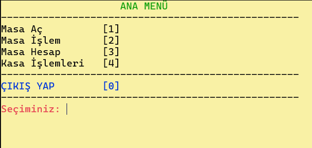
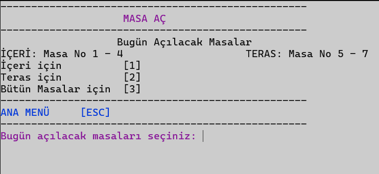
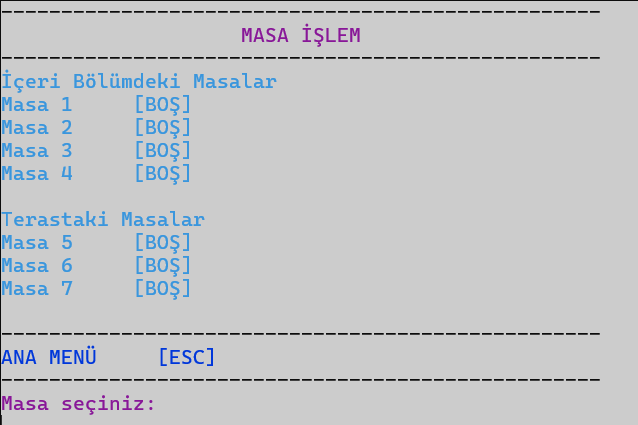
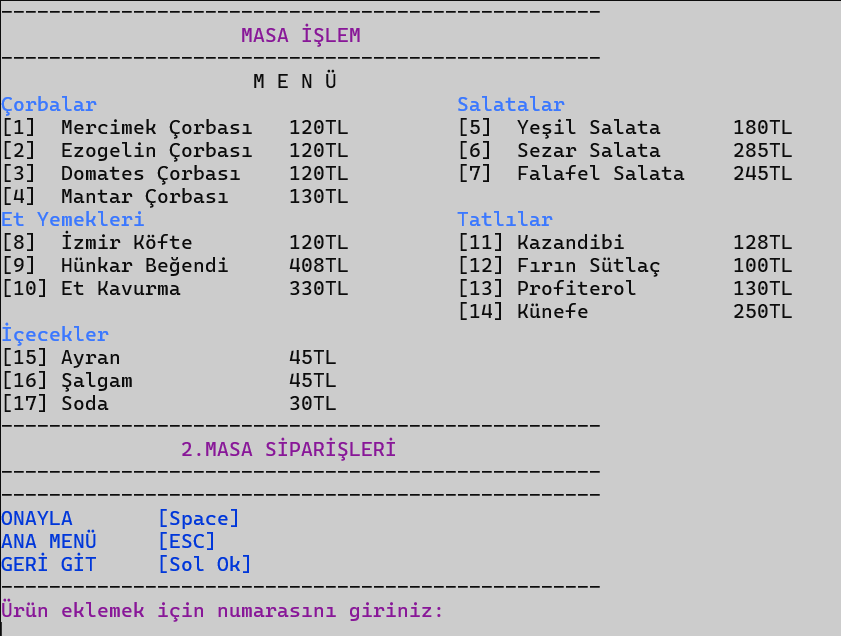
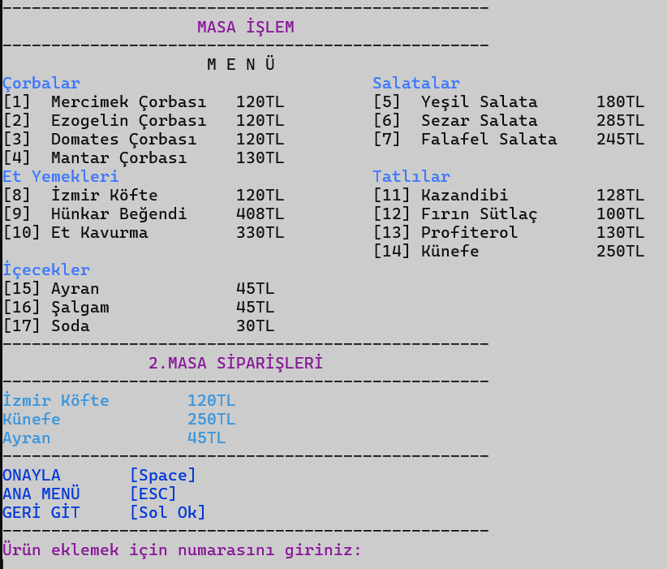
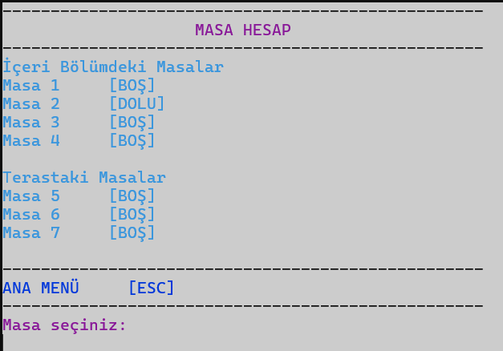
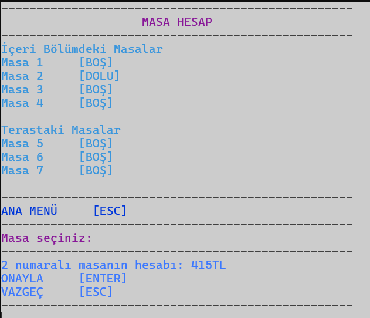
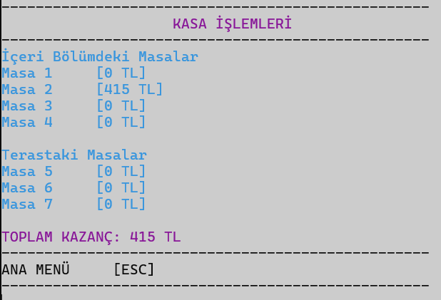

# Restoran Siparis Yonetim Sistemi
C# dilinin en basit hali ile yazılmıştır. Restoranlarda kullanılabilecek küçük bir sipariş senaryosu olarak hazırlanmıştır.

### Ana Menü
Çalıştırıldığında ilk ekrana gelen bölüm.

### Masa Açma
Senaryoya göre örneğin bugün yağmurlu ise teras masaları kullanılmaz sadece içeride bulunan masalar kullanılır.

### Masa İşlemleri
Müşteri geldiğinde siparişleri almak için kullanılan bölüm. Masa no seçince bir sonraki ekrana geçilir.

### Yemek Menü
Yemek menüsü ekrana gelir ve numaraları girerek seçimler yapılır.

Son girilen ürünü iptal etmek için sol oku kullanılır. Siparişi onaylamak için Space kullanılır ve masa dolu duruma geçer.

### Masa Hesap
Bu menü kullanılarak masa seçilip ödemesi alınır ve toplam kazanca eklenir.

Masanın ne kadar ödemesi olduğu görünür ve onaylayarak ödeme sonlanır. Masa yeniden boş duruma döner.

### Kasa İşlemleri
Restoranın şu ana kadar toplam ne kadar para kazandığı ve her bir masadan ne kadar kazandığı görülür.

